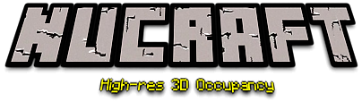
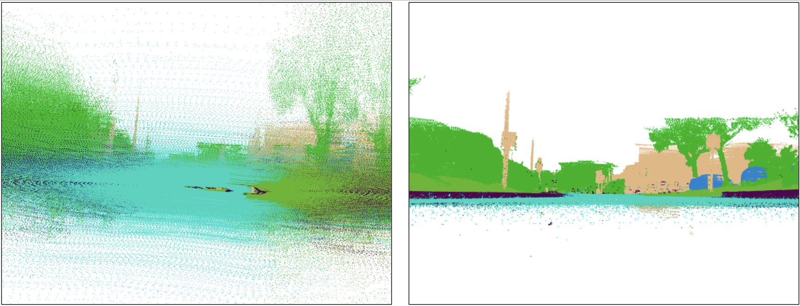
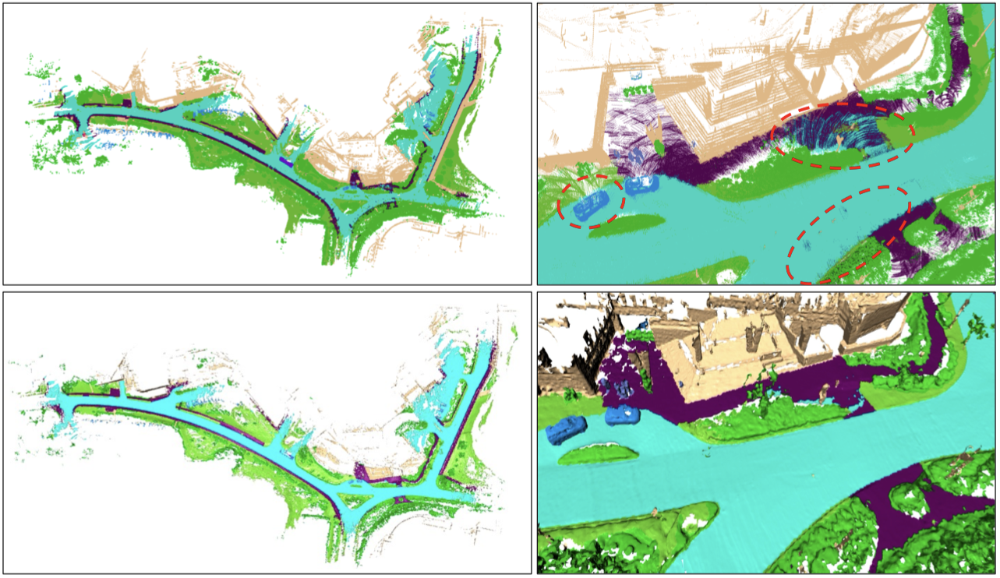
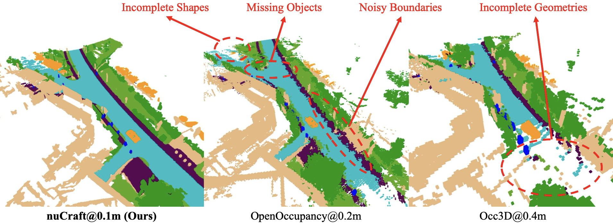
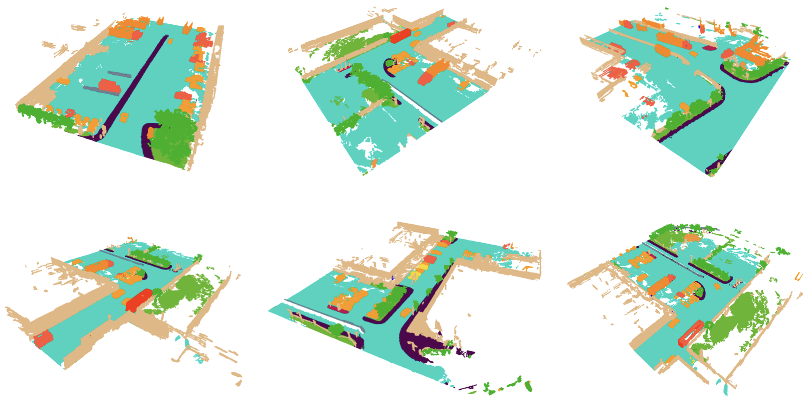

<div id="top" align="center">


<p align="center">
  
</p>

[Project Page](https://poodarchu.github.io/publication/eccv2024_nucraft/)

Download: \[ [Kaggle](https://www.kaggle.com/datasets/poodar/nucraft) \]  \[ [HuggingFace](https://huggingface.co/datasets/V2AI/nuCraft) \]


###  nuCraft: Crafting High Resolution 3D Semantic Occupancy for Unified 3D Scene Understanding 

<p align="center"><a href="https://poodarchu.github.io/"><b>Benjin Zhu</b></a><sup>1</sup>, <a href="https://wang-zhe.me/">Zhe Wang</a><sup>2</sup>, <a href="https://www.ee.cuhk.edu.hk/~hsli/">Hongsheng Li</a><sup>1,3</sup></p>

<p align="center"><sup> <sup>1</sup> MMLab, The Chinese University of Hong Kong </sup> <sup> <sup>2</sup> SenseTime Research </sup> <sup> <sup>3</sup> Shanghai AI Laboratory </sup> </p>

</div>

## News
- **`2024/07/15`** nuCraft@0.1 dataset `v1.0` released.
- **`2024/07/01`** nuCraft is accepted by ECCV 2024.

## Overview
nuCraft is a cutting-edge, high-resolution 3D semantic occupancy dataset designed to meet the increasing demand for accurate and comprehensive 3D scene understanding in autonomous driving. Derived from the widely-utilized nuScenes dataset, nuCraft distinguishes itself by offering an **8x increase in resolution** over previous benchmarks, with grid resolution increased to **0.1 meters**.

The motivation behind nuCraft stems from the inherent limitations present in existing 3D semantic occupancy datasets, such as low resolution and inaccurate annotations. These limitations hinder the effective unification and understanding of complex urban scenes needed for innovative autonomous driving technologies. In response, nuCraft addresses these issues by ensuring more precise semantic annotations and higher resolution, thus facilitating more refined and accurate occupancy predictions.

### Wrong Ego Poses
<p align="center">
  
</p>

### Inconsistent Semantic Labels
<p align="center">
  
</p>

### Visual Comparison
<p align="center">
  
</p>

nuCraft represents a significant step forward in 3D scene understanding, integrating high-resolution data with advanced processing techniques to provide a superior dataset for researchers and developers. Its release is poised to drive innovations and improve the accuracy of autonomous driving technologies.


## Key Features
* **High Resolution**: nuCraft provides semantic occupancy grids at a resolution of **[1024 x 1024 x 80]** with a voxel size of 0.1m, compared to the **[512 x 512 x 40]** 0.2m grids in existing datasets.
* **Enhanced Data Quality**: It mitigates the impact of noisy and sparse raw data, delivering more accurate and consistent annotations.
* **Comprehensive Labels**: The dataset includes fine-grained semantic labels for both static elements (like buildings and roads) and dynamic elements (such as vehicles and pedestrians). It also provides **accurate and dense occupancy flow and depth label** (in future release).

<p align="center">
  
</p>


## Data Generation Pipeline
The creation of nuCraft involves several meticulous steps:
1. **Pre-Processing**: This includes static/moving parts separation to enhance the clarity of static and dynamic scene components and continuous scenes grouping to form longer, cohesive sequences.
2. **LiDAR Sequence Aggregation**: Advanced pose estimation techniques like Kiss-ICP are employed to ensure better alignment of LiDAR frames, resulting in more reliable aggregated point clouds.
3. **Mesh Reconstruction**: Multi-level octree structures and semantic mesh reconstruction techniques ensure high-quality and noise-free occupancy grids.
4. **Post-Processing**: Further data refinement is done to remove outliers, reduce noise, and generate visibility masks for both LiDAR and camera sensors.

## Acknowledgement 
nuCraft is built upon the groundwork laid by the **nuScenes** dataset and integrates advanced methodologies elaborated in papers dealing with 3D occupancy prediction like **SemanticKITTI**, **OpenOccupancy** and **Occ3D**. The design and implementation of **nuCraft** are aimed at overcoming the specific deficiencies observed in these early datasets, inspired by academic research and practical requirements of modern autonomous driving systems.


## License

The nuCraft dataset is under [CC BY-NC-ND 4.0](https://creativecommons.org/licenses/by-nc-nd/4.0/) license.
All assets and code within this repository are under the [Apache 2.0](/LICENSE.txt) license unless specified otherwise.

## Citation
If this work is helpful for your research, please consider citing the following BibTeX entry.
```
@inproceedings{zhu2024nucraft,
  title={nuCraft: Crafting High Resolution 3D Semantic Occupancy for Unified 3D Scene Understanding},
  author={Zhu, Benjin and Wang, Zhe and Li, Hongsheng},
  booktitle={Proceedings of the IEEE/CVF Conference on European Conference on Computer Vision},
  year={2024}
}

```
